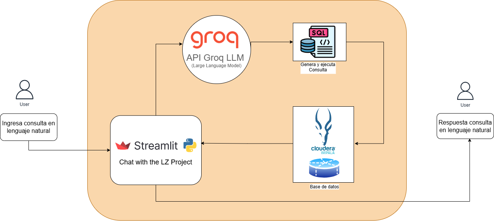

#  Chatbot para consultas SQL con integración de Groq e Impala

Bienvenido al Chat with the LZ Project, un chatbot potente basado en Streamlit que utiliza Groq y una clase auxiliar personalizada para generar y ejecutar consultas SQL en respuesta a entradas en lenguaje natural. Este proyecto está diseñado por los analiticos del area de integración buscando una forma intuitiva de interactuar con grandes conjuntos de datos usando un lenguaje simple y comprensible.

# Características
- **Interacción en Lenguaje Natural**: Escribe tus consultas en lenguaje cotidiano y obtén respuestas basadas en SQL.
- **Generación Dinámica de Consultas SQL**: Usa Groq para interpretar la intención del usuario y generar consultas SQL precisas.
- **Integración con Bases de Datos**: Se conecta a una base de datos Impala para recuperar y mostrar resultados.
- **Interfaz Gráfica con Streamlit**: Una interfaz amigable que facilita la interacción tanto con Groq como con la base de datos.
- **Conocimiento del Esquema**: Recupera y muestra dinámicamente los esquemas de tablas para mejorar la precisión de las consultas.

## Arquitectura




- **1. Entrada del Usuario**: Acepta consultas en lenguaje natural a través de la interfaz de Streamlit.
- **2. Recuperación del Esquema**: Obtiene dinámicamente detalles de los esquemas de tablas para consultas basadas en contexto.
- **3. Generación de Consultas**: Groq interpreta la entrada del usuario y genera la consulta SQL correspondiente.
- **4. Ejecución en la Base de Datos**: Las consultas se ejecutan en la base de datos Impala mediante una clase auxiliar personalizada.
- **5. Visualización de Resultados**: Los resultados se formatean como un DataFrame y se muestran en la GUI.


# Instalación

### Clonar el proyecto

```
https://github.com/lriveraBanco/chat-with-lz.git
```

### Configuración el proyecto

Seleccionar el proyecto : Moverse al directorio principal

```
cd chat-with-lz
```

### Crear entorno virtual

```
python3 -m venv venv
```

### Activar entorno virtual

**Para Linux/MacOS**

```
source venv/bin/activate
```

**En Windows:**

```
venv\Scripts\activate
```

### Instalar dependencias

```
pip install -r requirements.txt
```

### Configurar variable del API GROQ

```
GROQ_API_KEY=[tu-clave-de-api-groq]
```

# USO

### 1. Ejecutar la Aplicación de Streamlit

Inicia la aplicación con el siguiente comando:
```
streamlit run app.py
```

### 2. Interactuar con el Chatbot

Escribe consultas en lenguaje natural, como:

- **"Muestra los registros más recientes para la API X."**
- **"¿Cuál es el esquema de la tabla Y?"**
- **"Obtén el promedio de usuarios por API en los últimos tres meses."**

El chatbot generará consultas SQL, las ejecutará y mostrará los resultados.
Use the sidebar to initialize the connection to the proceso_apis database.

**Estructura básica del proyecto:**

```plaintext
chat-with-lz/
│
├── docs/
│   ├── arquitectura.png
├── src/
│   ├── logs/
│   ├── .env
│   ├── app.py
├── .gitignore
├── Readme.md
└── requirements.txt
```

### Bibliotecas y Herramientas Clave
- **Conexion LZ via ODBC**
- **Python 3.9+**
- **Streamlit**: GUI interactiva para consultas y visualización de resultados.
- **Groq:** Motor de comprensión del lenguaje natural para generar consultas SQL.
- **Pandas:** Procesamiento y formato de datos.
- **Impala:** Backend de base de datos para ejecución SQL.
- **Dotenv:** Gestión de variables de entorno.

### Referencias
https://console.groq.com/
<br>
https://groq.com/
<br>
https://github.com/groq/groq-api-cookbook

## Contribuciones

**Si deseas contribuir a este proyecto, sigue estos pasos:**

1. Haz un fork del repositorio.
2. Crea una nueva rama (`git checkout -b feature-nueva-funcionalidad`).
3. Realiza tus cambios y haz commit (`git commit -m 'Agrega nueva funcionalidad'`).
4. Sube los cambios a la rama (`git push origin feature-nueva-funcionalidad`).
5. Abre un Pull Request.

## Licencia

Este proyecto está licenciado bajo la Licencia MIT. Consulta el archivo LICENSE para más detalles.

## Contacto

Leandro Rivera: <lrivera@bancolombia.com.co>


### ¡Feliz Codificación! 🚀
Si encuentras útil este proyecto, ¡dale una ⭐ en GitHub! 😊
